<!-- .slide: data-background="media/img/F-Lisbon.png" data-state="state--bg-dark" -->

  <h1>Teaching XR technology as a Fulbright Fellow in Portugal</h1>
  

    Brenda A. López Silva | 2021 Fulbright Scholar 
  

  

 
<!-- NOTES -->
- Personal Intro and Who I am
- XR and my personal experience creating and teaching it

------
<!-- .slide: data-background-video="media/video/CAVE2.mp4" data-background-video-loop="true" data-background-video-muted="true" data-state="state--bg-dark" -->
# About me

VR application developer for 20+ years

Work with scientists and educators

Directed a university lab for learning technologies

Teach XR technologies at School of the Art Institute of Chicago (SAIC)

------
<!-- .slide: data-background="media/images/learning-0.jpg" -->

## [fit] Learning Environments

  

Current educational goals envision **learning environments** in which students are genuinely engaged in productive disciplinary work [^1]. Yet creating environments in which such experiences occur is neither common nor easy.

[^1]: Gardner, 1999; Lamon et al., 1996; National Council of Teachers of Mathematics [NCTM], 1991, 2000; National Science Foundation, 1997

---
# Augmented Reality 

<!-- .element: class="stretch" -->

<!-- .slide: data-background-video="media/video/escs-ar.mp4" data-background-video-loop="true" data-background-video-muted="true" data-state="state--bg-dark" -->

---
<!-- .slide: data-background-video="media/video/VR-ESCS-demo.mp4" data-background-video-loop="true" data-background-video-muted="true" data-state="state--bg-dark" -->
# Real-Time Interaction

<!-- .element: class="stretch" -->
---

<!-- .slide: data-background-video="media/video/ComunicacaoMultimedia.mp4" data-background-video-loop="true" data-background-video-muted="true" data-state="state--bg-dark" -->
# Comunicação Multimédia

<!-- .element: class="stretch" -->
---

  

  
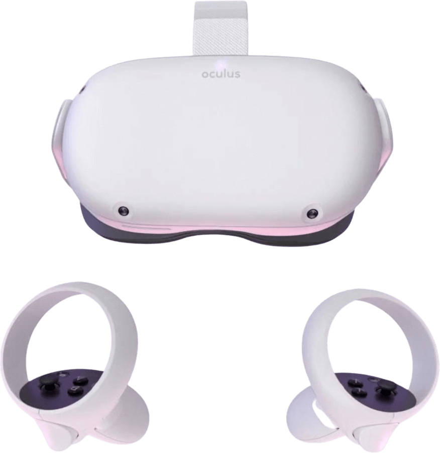

  

  

  

  

------

# Virtual Reality

<!-- .element: class="stretch" -->

<!-- .slide: data-background-video="media/video/virtualreality.mp4" data-background-video-loop="true" data-background-video-muted="true" data-state="state--bg-dark" -->

<!-- NOTES -->
- Ask how many have tried VR.
- Virtual reality is a technology platform that transports you to realistic, interactive, immersive 3D environments
- It's the next platform, will change how we work + play + communicate digitally, face of society

---
<!-- .slide: data-background="media/img/brain.jpg" -->
# Multisensory Experiences in VR
<!-- .element: class="stretch" -->

---
<!-- .slide: data-background="media/img/CAVE2-Antarctica.jpg" -->
# The Five I’s of VR
    

  
Immersive

  
Interactive

  
Intense

  
Illustrative

  
Intuitive

<!-- NOTES -->
Elements of a VR multi-sensory experience

------
<!-- .slide: data-background-color="#333" -->
# My Own Five I’s of Living in Portugal

---
<!-- .slide: data-background-color="#333" -->
## Immersive

<!-- .element: class="stretch" -->

  

    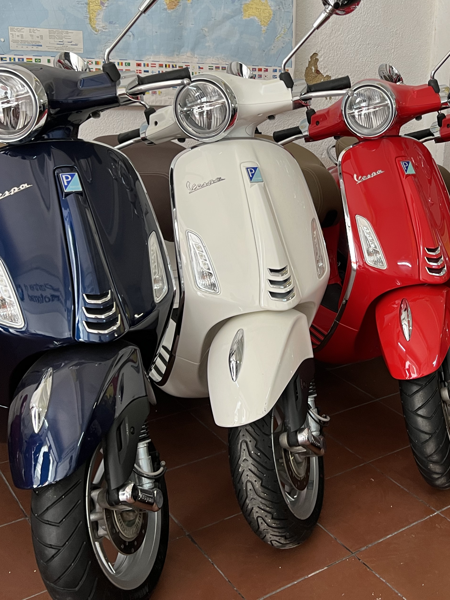
  

  

    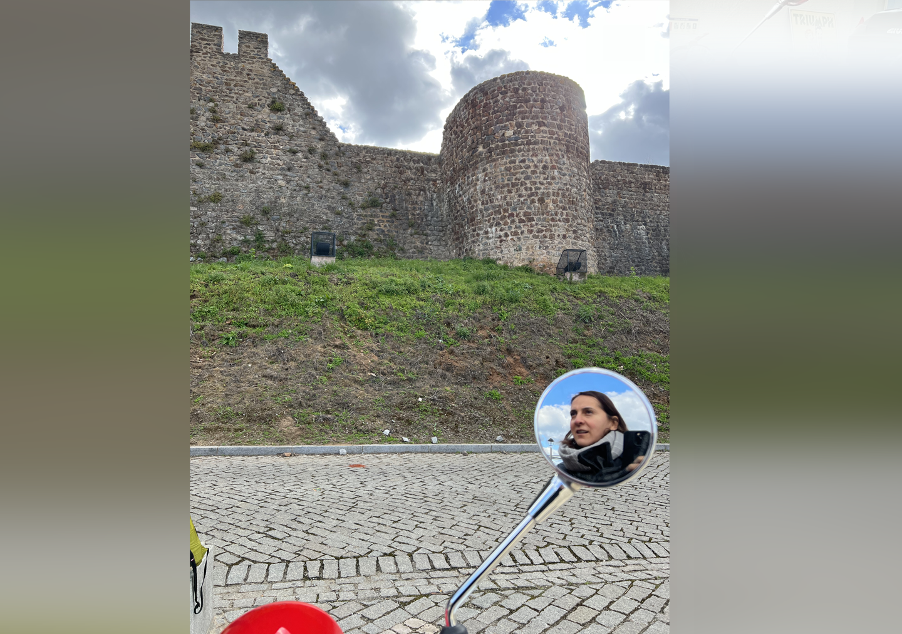
  

  

    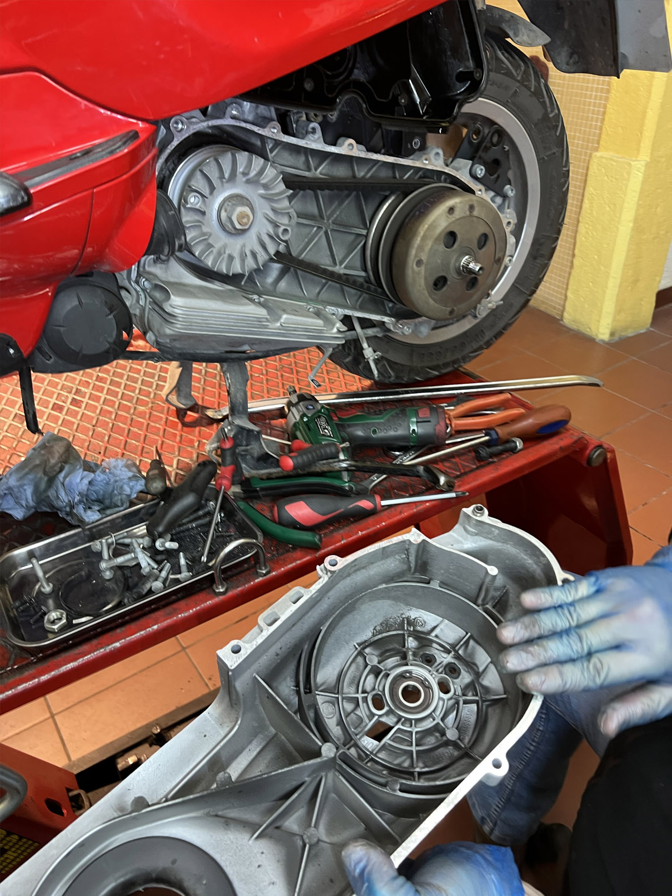
  

---
<!-- .slide: data-background="media/img/vespa-tour.gif" -->
# Immersive 

<!-- .element: class="stretch" -->
---

<!-- .slide: data-background-video="media/video/Cabeca-Portugal.mp4" data-background-video-loop="true" data-background-video-muted="true" data-state="state--bg-dark" -->

# Interactive

<!-- .element: class="stretch" -->

---

<!-- .element: class="stretch" -->

# Intense

<!-- .slide: data-background-video="media/video/Azores-earth.mp4" data-background-video-loop="true" data-background-video-muted="true" data-state="state--bg-dark" -->

---
# Illustrative

<!-- NOTES -->
- Capturing reality to bring it into XR environments
- We can make spaces and objects available locatin independent

---
<!-- .slide: data-background-color="#333" -->

# Intuitive 
<!-- .slide: data-background-video="media/video/intuitive-azores.mp4" data-background-video-loop="true" data-background-video-muted="true" data-state="state--bg-dark" -->

------
# A Multisensory Experience

  
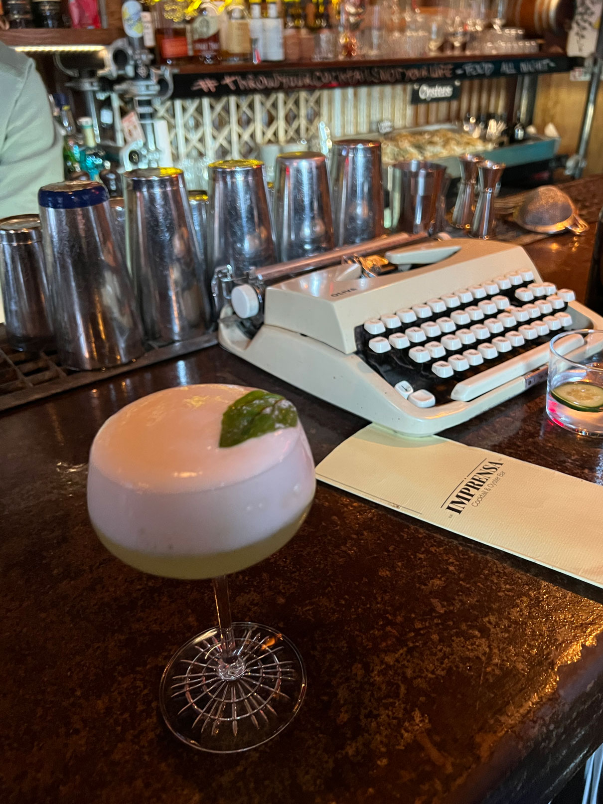

  
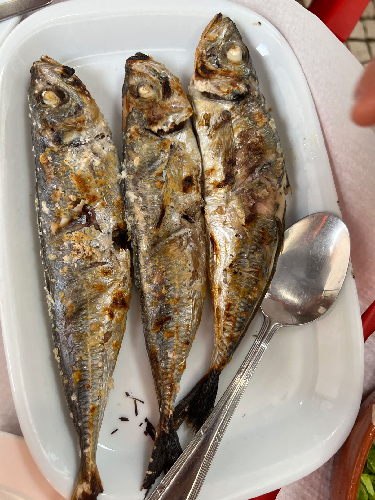

  
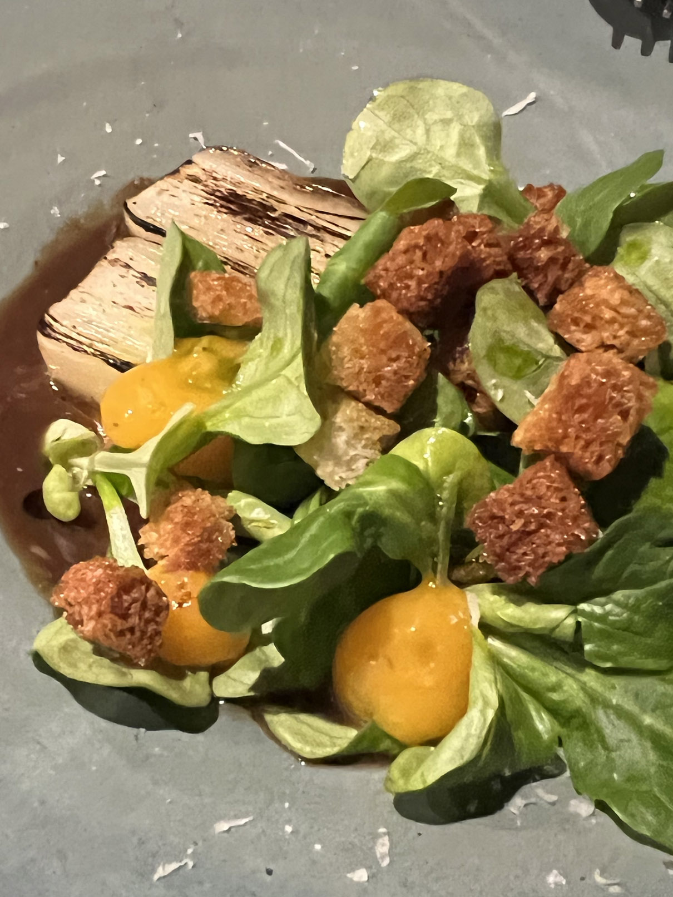

<!-- NOTES -->
- In XR the hardest senses to simulate are smell and taste

---

  
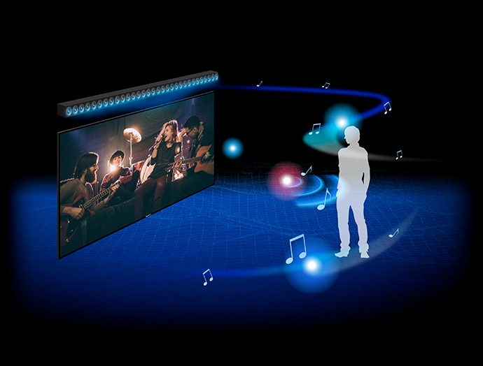

  
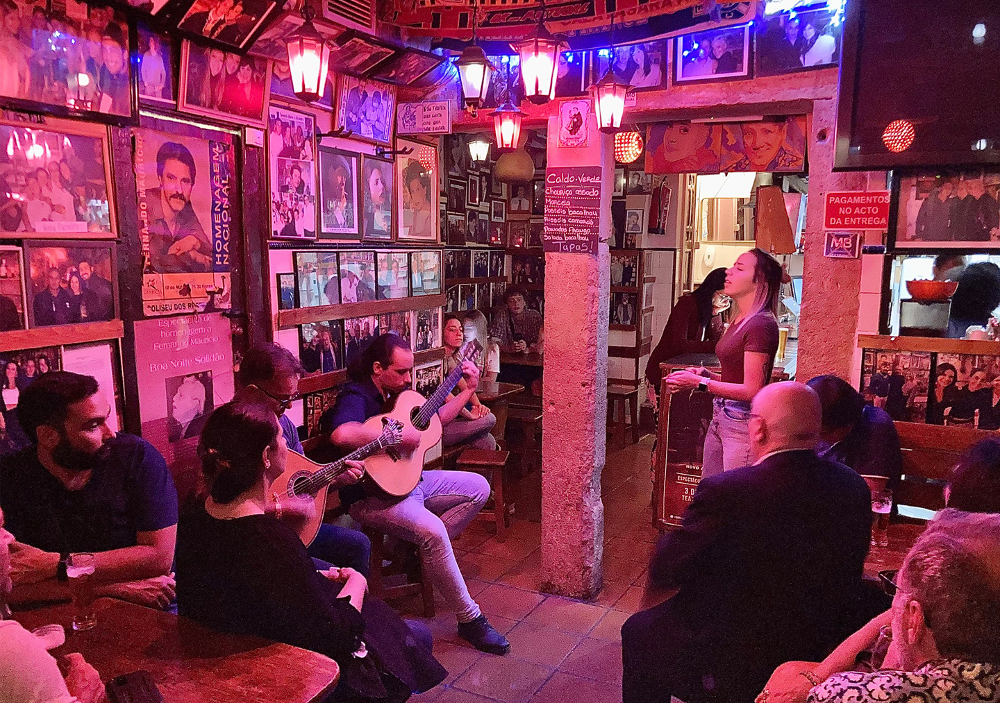

---

  
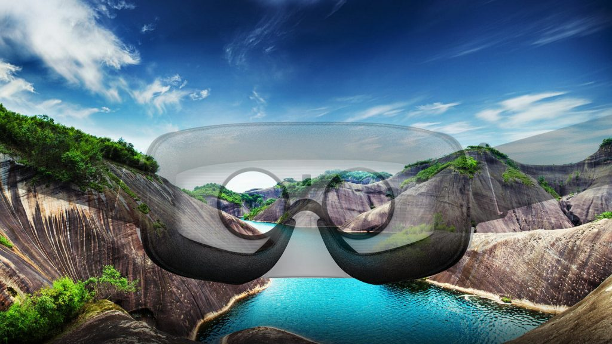

  
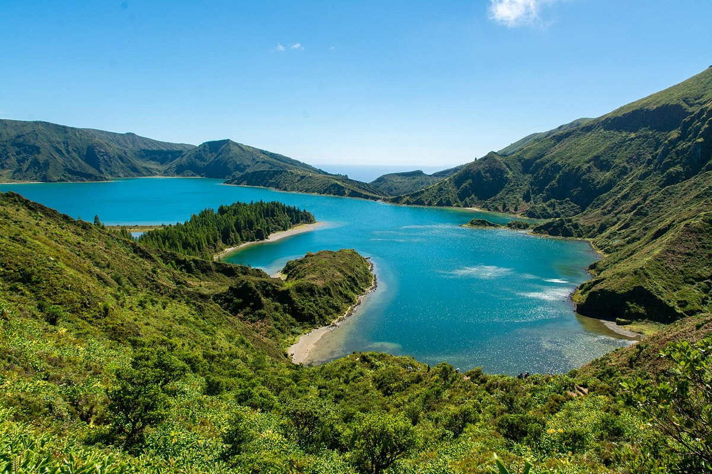

<!-- NOTES -->
- sense of Sight

---

  

  

<!-- NOTES -->
- sense of touch

------
# Muito Obrigada!

  

    
    <i>• Dora Reis Arenga</i>
    <i>• Otília Macedo Reis</i>
    

    <i></i><i></i><i></i><i></i><i></i><i></i>
    

  

  

    
    <i>• Sandra Lopez Miranda</i>
    <i>• Martina Redondo</i>
    <i>• Mariana Rita</i>
    <i>• Ricardo Rodriguez</i>
  

  

    
    <i>• Miguel Batista</i>
    <i>• Ricardo Pereira</i>
    <i>• Margarida Carvalho</i>
    <i>• Filipe Montargil</i>
  

<!-- NOTES -->
- 