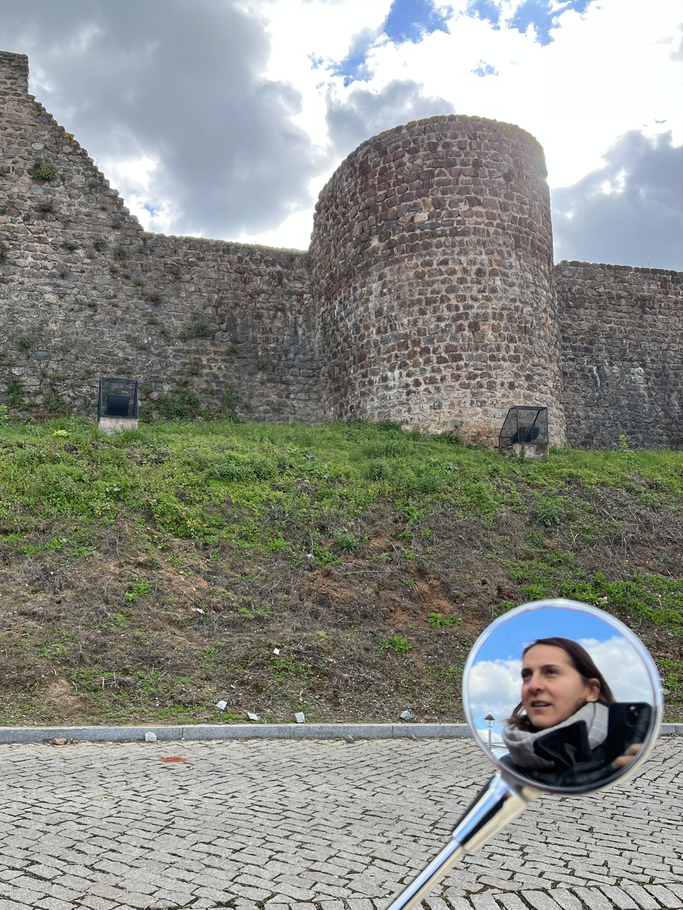
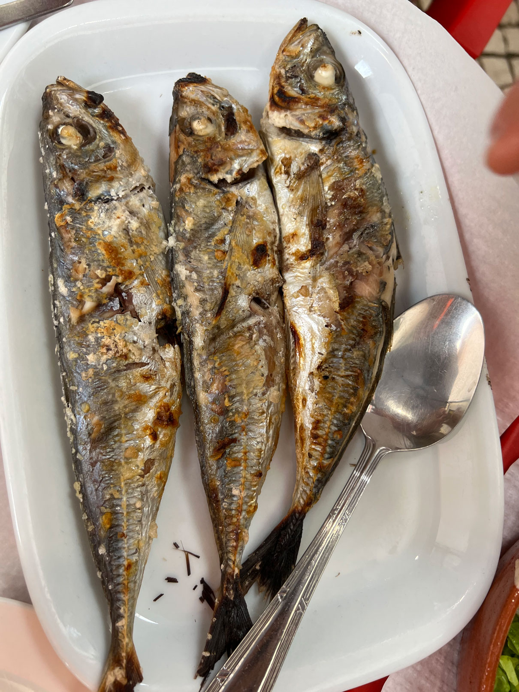

<!-- .slide: data-background="media/img/F-Lisbon.png" -->

<div class="talk-title">
  <h1>Teaching XR technology as a Fulbright Fellow in Portugal.</h1>
  <p>Experience in Portugal</p>
  <p class="talk-info">
    @nanocontroller | Brenda A. Lopez Silva | **Fulbright US Scholar 2021**
  </p>
</div>

<!-- NOTES -->
- Personal Intro and Who I am
- XR and my personal experience creating and teaching it

------
<!-- .slide: data-background-video="media/video/CAVE2.mp4" data-background-video-loop="true" data-background-video-muted="true" data-state="state--bg-dark" -->
# About me
<div class="slide__boilerplate">
<p>Worked with VR for 20+ years</p>
<p>Developed Learning Technologies with scientists</p>
<p>Created a Lab for learning technolgy R&D</p>
<p>Teach eXtended Reality in Chicago</p>
<p>Lucky to be a Fulbright Scholar</p>

------
<!-- .slide: data-background="media/img/escs.jpg" -->
# Fulbright in Lisbon
## ESCS

<div class="slide__boilerplate">
  <p>Augmented Reality </p>
  <p>Real-Time Interaction</p>
  <p>Comunicao Multimedia</p>
</div>

---
<!-- .slide: data-background-video="media/video/escs-ar.mp4" data-background-video-loop="true" data-background-video-muted="true" data-state="state--bg-dark" -->
# Augmented Reality 
---

<!-- .slide: data-background-video="media/video/VR-ESCS-demo.mp4" data-background-video-loop="true" data-background-video-muted="true" data-state="state--bg-dark" -->
# Real-Time Interaction

---

<!-- .slide: data-background-video="media/video/ComunicacaoMultimedia.mp4" data-background-video-loop="true" data-background-video-muted="true" data-state="state--bg-dark" -->
# Comunicacao Multimedia

------

# Virtual Reality

<!-- .slide: data-background-video="media/video/virtualreality.mp4" data-background-video-loop="true" data-background-video-muted="true" data-state="state--bg-dark" -->

<!-- NOTES -->
- Ask how many have tried VR.
- Virtual reality is a technology platform that transports you to realistic, interactive, immersive 3D environments
- It's the next platform, will change how we work + play + communicate digitally, face of society

---
<!-- .slide: data-background="media/img/CAVE2-Antarctica.jpg" -->
# Virtual Reality’s Five i’s

Focus on multisensorial experiences

<div class="slide__boilerplate">
  <p>Immersive </p>
  <p>Interactive</p>
  <p>Intense</p>
  <p>Illustrative</p>
  <p>Intuitive</p>
</div>


------
<!-- .slide: data-background-color="#333" -->
# My experience in Portugal 

Considering the five i's of VR and XR experiences...

---
<!-- .slide: data-background-color="#333" -->
## Multisensorial Experience

An oportunity to extend a cultural exchange

<div class="captioned-image-row">
  <div>
    
    <i>Buying</i>
  </div>
  <div>
    
    <i>Riding</i>
  </div>
  <div>
    
    <i>Fixing!</i>
  </div>
</div>

---
<!-- .slide: data-background="media/img/vespa-tour.gif" -->
# Immersion in Portugal 

---
<!-- .slide: data-background-video="media/video/Cabeca-Portugal.mp4" data-background-video-loop="true" data-background-video-muted="true" data-state="state--bg-dark" -->

# Interaction in Portugal 

---

# Intense [in the Azores]

https://earth.google.com/web/data=MkEKPwo9CiExRGxjSVNxQ1JBR1ZMTU9kbmtWZmlJa0o3cGJzbDBOYnYSFgoUMDI3MzUzNzI5MjIyMTE3NUQ5RUEgAQ

---
# Illustrative [Capturing Reality for XR]

<div class="stretch" data-aframe-scene="scenes/azores1.html"></div>

<!-- NOTES -->
- Capturing the real world to bring it into XR environments
- Works on VR, AR,

------
<!-- .slide: data-background-color="#333" -->
# Intuitive & Multisensorial

---
# Sense of taste

<div class="image-row">
  <div></div>
  <div></div>
  <div></div>
</div>


<!-- NOTES -->
- Not only the places are great, but i also had an opportunity to eat and enjoy the delicious food 

---

# sense of smell

------


# Registry

<!-- .slide: data-background-color="#333" -->

Curated collection of A-Frame components.

<video loop data-src="media/video/leaphands.mp4" data-autoplay></video>

---


# THE END

------
# WebVR

An open virtual reality platform with the advantages of **the Web**

<div class="captioned-image-row">
  <div>
    
    <i>Open</i>
  </div>
  <div>
    
    <i>Connected</i>
  </div>
  <div>
    
    <i>Instant</i>
  </div>
</div>

<!-- NOTES -->
WebVR is...virtual reality in the browser, powered by the Internet

Open:
- Anyone can publish
- Open source culture with open standards

Connected:
- Traverse worlds

Instant:
- Click a link on Twitter or Weibo, immediate VR experiences
- No installs
- Imagine for long tail experiences: shopping & personal spaces
- Great for long tail bite-sized experiences

Transition:
- Web has advantages that make it the best platform for the people
- Need to act to make it reality, can't wait for VR to bake and crystallize
- Get involved

---


Browser APIs that enable WebGL rendering to headsets and access to VR
sensors

https://w3c.github.io/webvr/

<!-- NOTES -->
API:
- Optimized rendering path to headsets
- Access position and rotation (pose) data

History:
- Initial WebVR API by Mozilla
- Working W3C community group
- Mozilla, Google, Samsung, Microsoft, community currently iterating WebVR 1.0 API

Not just a specification, it's implemented...

---

https://webvr.rocks

<div class="captioned-image-row small">
  <div>
    
    <i>Firefox Nightly</i>
  </div>
  <div>
    
    <i>Microsoft Edge</i>
  </div>
  <div>
    
    <i>Chromium</i>
  </div>
</div>

<div class="captioned-image-row small">
  <div>
    
    <i>Chrome for Android</i>
  </div>
  <div>
    
    <i>Oculus Carmel</i>
  </div>
  <div>
    
    <i>Samsung Internet</i>
  </div>
  <div>
    
    <i>Mobile Polyfill</i>
  </div>
</div>

<!-- NOTES -->
- Firefox + Chrome WebVR 1.0 hits release channels by early 2017
- Currently behind Nightly, custom builds, and flags
- Mobile Polyfill: use device motion / orientation sensors to polyfill on smartphones
- With all the browsers behind it...

---


------

## Hello Metaverse

<i>by Ada Rose Edwards (@lady_ada_king)</i>

<!-- .slide: data-background="media/img/metaverse.jpg" -->

<div class="stretch" data-aframe-scene="scenes/80s.html"></div>

<!-- NOTES -->
- A-Frame scene by Ada Rose Edwards running from inside my HTML slides
- Works on desktop, Android, iOS, Samsung Gear VR, Oculus Rift, HTC Vive
- Could open up the DOM Inspector to change values live

---

# Entity-Component-System

<!-- .slide: data-background="media/img/minecraft-blocks.png" -->

<!-- NOTES -->
- Is an entity-component framework
- Popular in game development, used by Unity
- All objects in scene are **entities** that inherently empty objects. Plug in
  **components** to attach appearance / behavior / functionality
- 2D web where every element was fixed
- 3D/VR is different, objects of infinite types and complexities, need an easy way to build up different kinds of objects

---


---

## Composing an Entity

<!-- .slide: data-background="media/img/minecraft-blocks.png" data-transition="none" -->

```html
<a-entity
  geometry="primitive: sphere; radius: 1.5"
  material="color: #343434; roughness: 0.4; sphericalEnvMap: #texture"
  position="-1 2 4" rotation="45 0 90" scale="2 2 2">
```
<!-- .element: class="stretch" -->

---

## Inspector

<!-- .slide: data-background="media/img/inspector.png" data-state="state--bg-dark" -->

Visual tool for A-Frame. Just `<ctrl>+<alt>+i`.

<div class="stretch" data-aframe-scene="scenes/80s.html"></div>

------

<!-- .slide: data-background="media/img/header.png" -->

# Community

https://aframe.io/blog/

---

<!-- .slide: data-background="media/img/apainter.gif" -->

# Art - *A-Painter*

@mozillavr

---

<!-- .slide: data-background="media/img/syria.gif" -->

# Journalism - *Fear of the Sky*

Amnesty International UK

---

<!-- .slide: data-background="media/img/mars.jpg" -->

# Journalism - *Journey to Mars*

The Washington Post

---

<!-- .slide: data-background="media/img/citybuilder.gif" -->

# Sandbox - *City Builder*

@kfarr

---

<!-- .slide: data-background="media/img/adit.gif" -->

# Data Visualization - *Adit*

@datatitian

---

<!-- .slide: data-background="media/img/a-blast.gif" -->

# Gaming - *A-Blast*

@mozillavr

---

<!-- .slide: data-background="media/img/ux.gif" -->

# Prototyping - *UI Widgets*

@whoyee

---

<!-- .slide: data-background="media/img/math.gif" -->

# Mathematics - *MathworldVR*

@sleighdogs

---

<!-- .slide: data-background="media/img/ar.gif" -->

# AR - *AR.js + A-Frame*

@jerome_etienne

---

<!-- .slide: data-background="media/img/webvrstudio.png" -->

# Tools - *WebVR Studio*

@webvrstudio

---

<!-- .slide: data-background-video="media/video/livetour.mp4" data-background-video-loop="true" -->

# Real Estate - *Live Tour*

iStaging

---

<!-- .slide: data-background="media/img/cadavr.gif" -->

# Education - *CadaVR*

@drryanjames

---

# aframe.io

<div class="captioned-image-row">
  <div>
    
    <i>180+ contributors 6000+ Stargazers</i>
  </div>
  <div>
    
    <i>4000+ members on Slack</i>
  </div>
  <div>
    
    <i>100s of featured projects</i>
  </div>
</div>

<!-- NOTES -->
- Open source and inclusive project
- Most work done on GitHub
- Active community on Slack to share projects, interact, hang out, seek help
- Featured projects on the `awesome-aframe` repository and *A Week of A-Frame* blog
