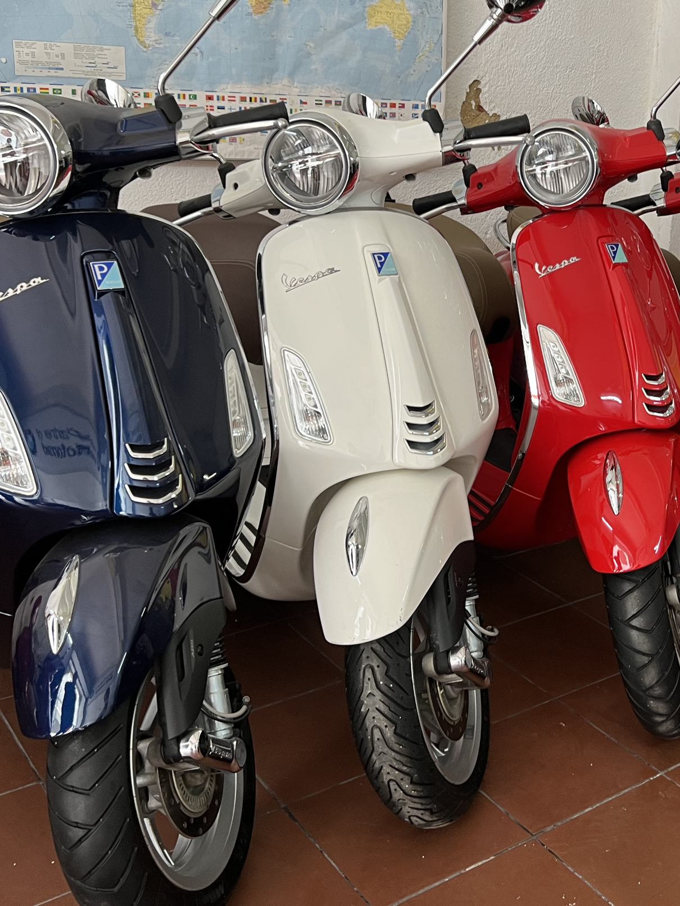
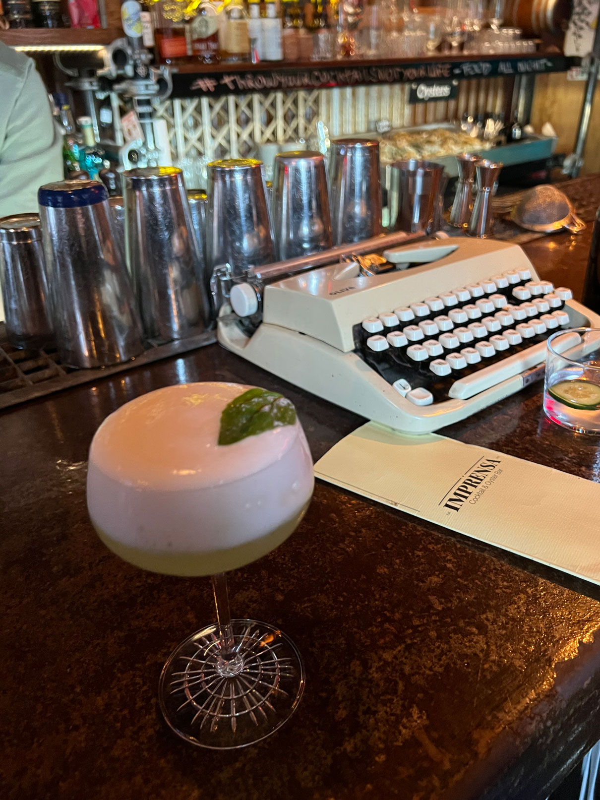
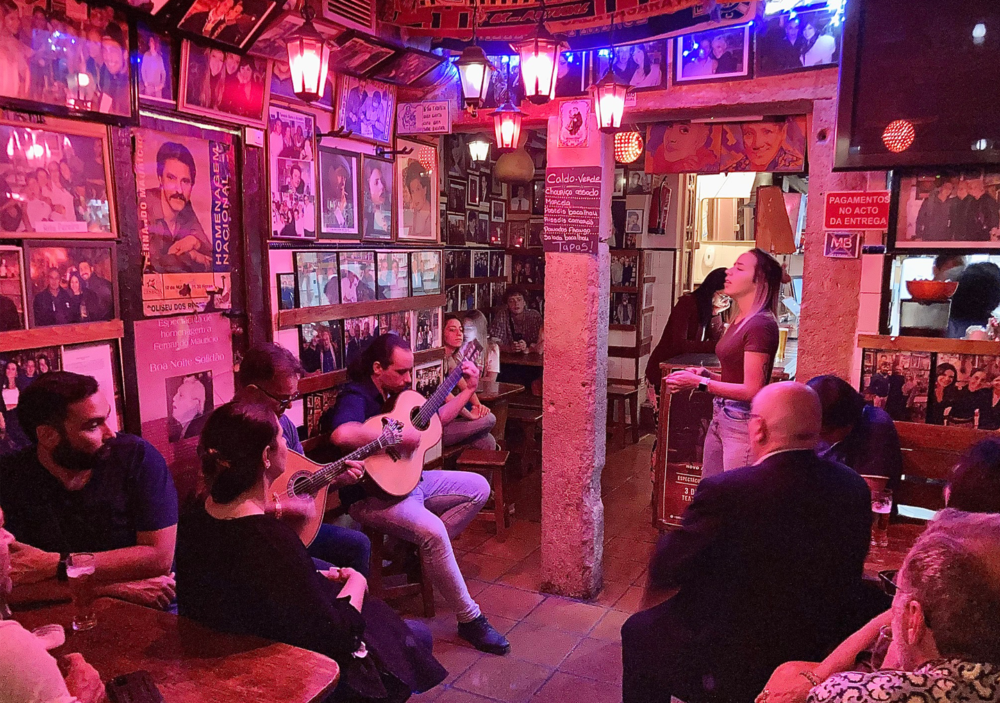
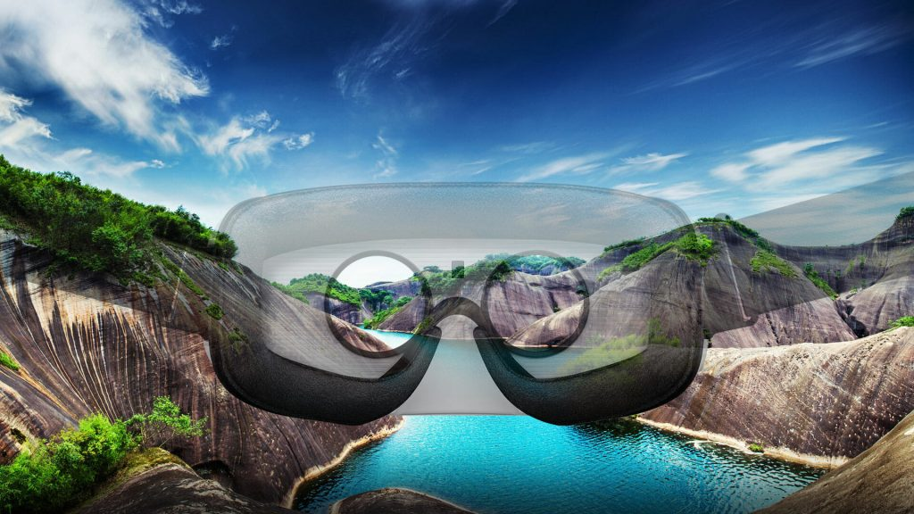
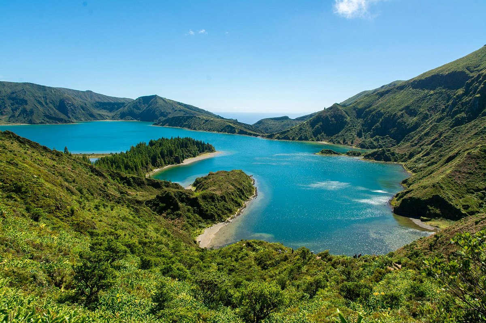

<!-- .slide: data-background="media/img/F-Lisbon.png" -->

  <h1>Teaching XR technology as a Fulbright Fellow in Portugal</h1>
  

    Brenda A. López Silva | 2021 Fulbright Scholar 
  

 
<!-- NOTES -->
- Personal Intro and Who I am
- XR and my personal experience creating and teaching it

------
<!-- .slide: data-background-video="media/video/CAVE2.mp4" data-background-video-loop="true" data-background-video-muted="true" data-state="state--bg-dark" -->
# About me

VR application developer for 20+ years

Works with scientists and educators

Directed a university lab for learning technologies

Teaches XR technologies at School of the Art Institute of Chicago (SAIC)

Lucky To Be a Fulbright Scholar in Portugal

------
<!-- .slide: data-background="media/img/escs.jpg" -->
# Fulbright in Lisbon
### Escola Superior de Comunicação Social

  
Augmented Reality

  
Real-Time Interaction

  
Comunicação Multimédia

---
<!-- .slide: data-background-video="media/video/escs-ar.mp4" data-background-video-loop="true" data-background-video-muted="true" data-state="state--bg-dark" -->
# Augmented Reality 

---
<!-- .slide: data-background-video="media/video/VR-ESCS-demo.mp4" data-background-video-loop="true" data-background-video-muted="true" data-state="state--bg-dark" -->
# Real-Time Interaction

---

<!-- .slide: data-background-video="media/video/ComunicacaoMultimedia.mp4" data-background-video-loop="true" data-background-video-muted="true" data-state="state--bg-dark" -->
# Comunicação Multimédia

------

# Virtual Reality

<!-- .slide: data-background-video="media/video/virtualreality.mp4" data-background-video-loop="true" data-background-video-muted="true" data-state="state--bg-dark" -->

<!-- NOTES -->
- Ask how many have tried VR.
- Virtual reality is a technology platform that transports you to realistic, interactive, immersive 3D environments
- It's the next platform, will change how we work + play + communicate digitally, face of society

---
<!-- .slide: data-background="media/img/CAVE2-Antarctica.jpg" -->
# The Five I’s of VR

  
Immersive

  
Interactive

  
Intense

  
Illustrative

  
Intuitive

<!-- NOTES -->
Elements of a VR multi-sensory experience

------
<!-- .slide: data-background-color="#333" -->
# My Own Five I’s of Living in Portugal

---
<!-- .slide: data-background-color="#333" -->
## Immersive

  

    
    <i>-</i>
  

  

    
    <i>-</i>
  

  

    
    <i>-</i>
  

---
<!-- .slide: data-background="media/img/vespa-tour.gif" -->
# Immersive 

---
<!-- .slide: data-background-video="media/video/Cabeca-Portugal.mp4" data-background-video-loop="true" data-background-video-muted="true" data-state="state--bg-dark" -->

# Interactive

---

# Intense

<!-- .slide: data-background-video="media/video/Azores-earth.mp4" data-background-video-loop="true" data-background-video-muted="true" data-state="state--bg-dark" -->

---
# Illustrative

<!-- NOTES -->
- Capturing reality to bring it into XR environments
- Works on VR, AR,

---
<!-- .slide: data-background-color="#333" -->
# Intuitive 
<!-- .slide: data-background-video="media/video/intuitive-azores.mp4" data-background-video-loop="true" data-background-video-muted="true" data-state="state--bg-dark" -->

------
# A Multisensory Experience

  

  

  

<!-- NOTES -->
- In XR the hardest senses to simulate are smell and taste

---

  

  

---

  

  

<!-- NOTES -->
- sense of Sight

---

  

  

<!-- NOTES -->
- sense of touch

------
# Muito Obrigada!

  

    
    <i>Dora Reis Arenga</i>
    <i>Otília Macedo Reis</i>
  

  

    
    <i>Sandra Lopez Miranda</i>
    <i>Martina Redondo</i>
    <i>Mariana Rita</i>
    <i>Ricardo Rodriguez</i>
    <i>Miguel Batista</i>
  

  

    
    <i>Patrick Symmes</i>
    <i>Laura Wolf & Alex Betts</i>
    <i>Marta Borowska</i>
    <i>Friends & Family</i>
  

<!-- NOTES -->
- Open source and inclusive project
- Most work done on GitHub
- Active community on Slack to share projects, interact, hang out, seek help
- Featured projects on the `awesome-aframe` repository and *A Week of A-Frame* blog
